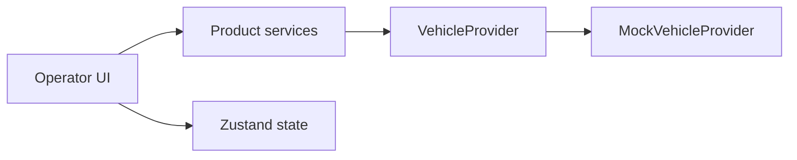

# Polaris Ground

Polaris Ground is a native, cross-platform Ground Control Station for operators monitoring Polaris vehicles. It presents vehicle health, mission progress, autonomy state, safety status, and operational events in product language.

It is not an onboard autonomy system, flight controller, navigation system, MAVLink implementation, firmware flasher, or vehicle-command interface.

## Current Milestone

The product foundation is a Tauri 2 desktop application powered by a deterministic `MockVehicleProvider`. It is deliberately **monitoring only**: no vehicle transport, discovery, networking, USB, serial access, or flight controls are included.

## Architecture



React components consume product-facing snapshots, never protocol fields. `VehicleService` owns provider lifecycle; focused services expose mission, telemetry, and timeline presentation logic. Future transport implementations replace the provider without changing the UI.

## Stack

- Tauri 2 and Rust
- React, TypeScript, Vite, Tailwind CSS
- Zustand, Vitest, React Testing Library
- ESLint, Prettier, rustfmt, Clippy

## Repository Layout

```text
src/components/  Shared UI, layout, and operator dashboard components
src/services/    Provider lifecycle and product service boundaries
src/providers/   VehicleProvider contract and deterministic mock
src/stores/      Vehicle snapshot and transient workspace state
src-tauri/       Minimal native application boundary
docs/            Product, architecture, and development references
```

## Screenshots


## Development

```sh
pnpm install
pnpm tauri dev
```

Run `pnpm lint`, `pnpm test`, `pnpm build`, and the Cargo checks before changes. See [product architecture](docs/architecture/PRODUCT_ARCHITECTURE.md) for the full diagrams.

## Current Limitations

The application is simulated and monitoring-only. Video, maps, mission editing, diagnostics, engineering mode, vehicle discovery, transport, and release signing are intentionally deferred.

## Roadmap

1. Introduce a reviewed real transport adapter behind `VehicleProvider`.
2. Add mission monitoring, diagnostics, configuration, and a separate engineering workspace.
3. Add controlled device and release workflows following safety review.
