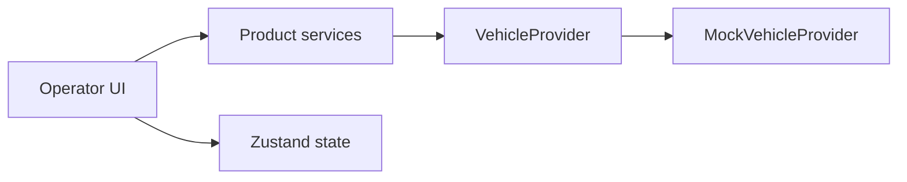
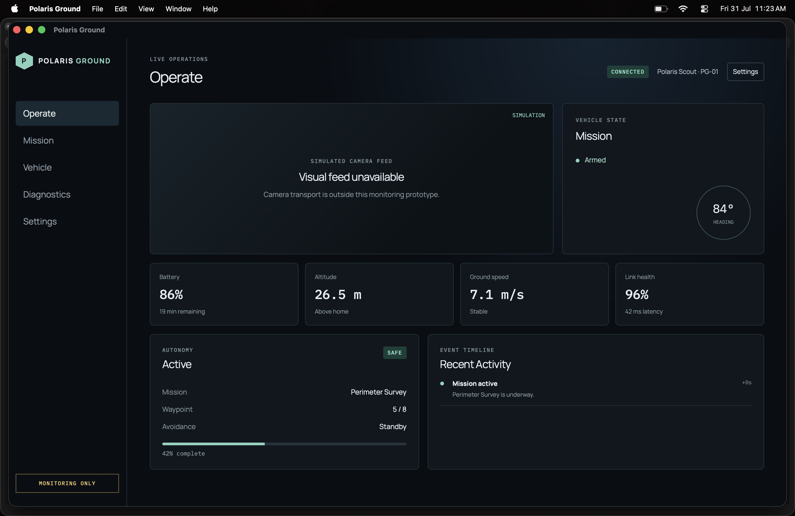

# Polaris Ground

Polaris Ground is a native, cross-platform Ground Control Station for operators monitoring Polaris vehicles. It presents vehicle health, mission progress, autonomy state, safety status, and operational events in product language.

It is not an onboard autonomy system, flight controller, navigation system, MAVLink implementation, firmware flasher, or mission-authoring tool.

## Current Milestone

v0.5 adds operator workspace foundations including map and mission workflows, plus Connection Settings and Diagnostics. Connection settings validate MAVLink UDP addresses, persist in browser local storage, and only take effect through explicit apply/reconnect. Diagnostics reports listener liveness, message/error counters, message freshness, heartbeat time, and the latest transport error from product-facing provider data; its copy action exports that summary without protocol payloads. `MockVehicleProvider` remains the default; `MavlinkVehicleProvider` uses MAVLink UDP when configured.

## Architecture



React components consume product-facing snapshots and actions, never protocol fields. `VehicleService` owns provider lifecycle; focused services expose mission, telemetry, and timeline presentation logic. MAVLink framing remains below the provider boundary.

## Stack

- Tauri 2 and Rust
- React, TypeScript, Vite, Tailwind CSS
- Zustand, Vitest, React Testing Library
- ESLint, Prettier, rustfmt, Clippy

## Repository Layout

```text
src/components/  Shared UI, layout, and operator dashboard components
src/services/    Provider lifecycle and product service boundaries
src/providers/   VehicleProvider contract and deterministic mock
src/stores/      Vehicle snapshot and transient workspace state
src-tauri/       Minimal native application boundary
docs/            Product, architecture, and development references
```

## Screenshots



## Development

```sh
pnpm install
pnpm tauri dev
```

Run `pnpm lint`, `pnpm test`, `pnpm build`, and the Cargo checks before changes. See [product architecture](docs/architecture/PRODUCT_ARCHITECTURE.md) for the full diagrams.

## Current Limitations

The command surface is intentionally limited. Parameter writes, firmware flashing, serial/USB access, scripting, and autonomous command execution are excluded. Video, engineering mode, vehicle discovery, and release signing remain deferred.

## Roadmap

1. Introduce a reviewed real transport adapter behind `VehicleProvider`.
2. Add mission monitoring, diagnostics, configuration, and a separate engineering workspace.
3. Add controlled device and release workflows following safety review.
