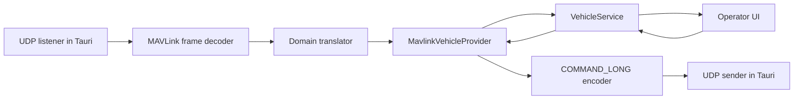

# MAVLink Command Transport

`MavlinkVehicleProvider` implements `VehicleProvider`. Select it with `VITE_VEHICLE_PROVIDER=mavlink`; the default remains `mock`. The command sender uses `VITE_MAVLINK_REMOTE_ADDRESS` (default `127.0.0.1:14540`); the listener continues to use `VITE_MAVLINK_BIND_ADDRESS`.

Inbound translations cover HEARTBEAT, SYS_STATUS, ATTITUDE, GLOBAL_POSITION_INT, STATUSTEXT, and COMMAND_ACK. Heartbeats identify the active vehicle's system and component IDs. Outbound commands are constrained to arm, disarm, takeoff (10 m), land, and return to launch, encoded as MAVLink 2 `COMMAND_LONG`. The UI uses domain action names and does not construct packets.

Each request is sent once and is recorded as pending. A matching `COMMAND_ACK` from the active vehicle changes it to accepted or rejected; no acknowledgement within five seconds changes it to timed out. The provider prevents duplicate pending MAVLink commands. CRC-extra is encoded for outbound `COMMAND_LONG`; inbound frames remain subject to the v0.2 parser limitation described in the SITL validation guide.

PX4 SITL validation is required before this feature can be considered transport-verified. This workspace has no PX4 SITL executable installed.
