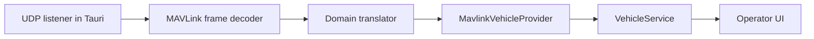

# Read-Only MAVLink Transport

`MavlinkVehicleProvider` satisfies the unchanged `VehicleProvider` contract. Select it with `VITE_VEHICLE_PROVIDER=mavlink`; the default remains `mock`. The listener accepts incoming UDP frames only and exposes no command, mission, parameter, USB, serial, or control API.

Initial translations cover HEARTBEAT, SYS_STATUS, ATTITUDE, GLOBAL_POSITION_INT, and STATUSTEXT. Heartbeats identify the active vehicle's system and component IDs. Unsupported or malformed frames are discarded without affecting UI state.

PX4 SITL validation is required before this feature can be considered transport-verified. This workspace has no PX4 SITL executable installed.
