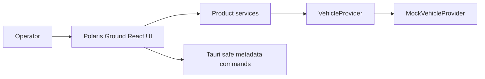
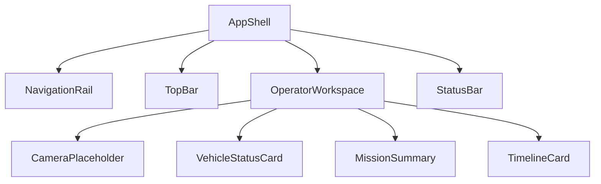
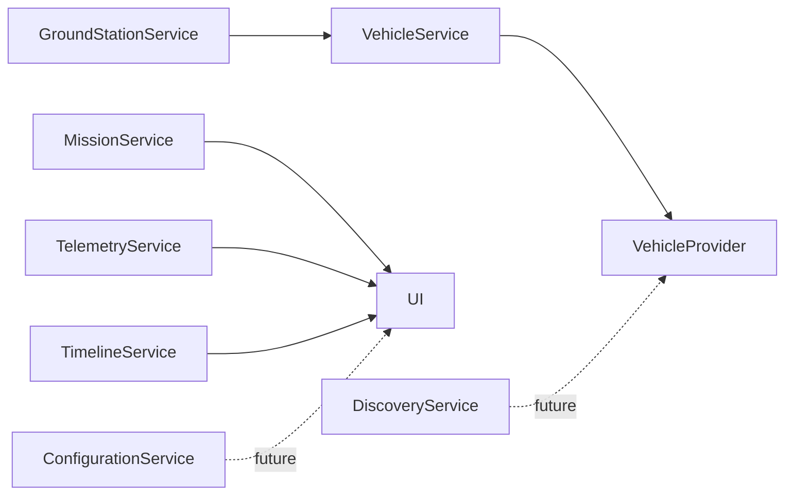
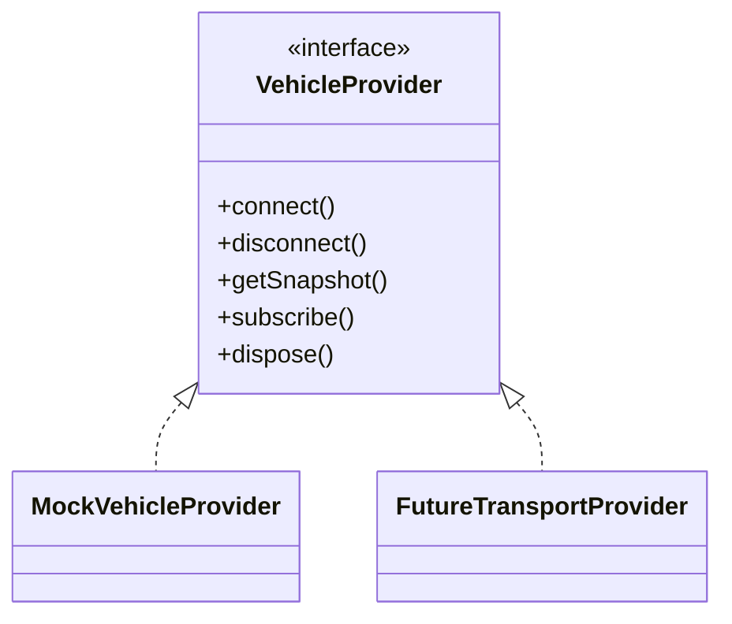
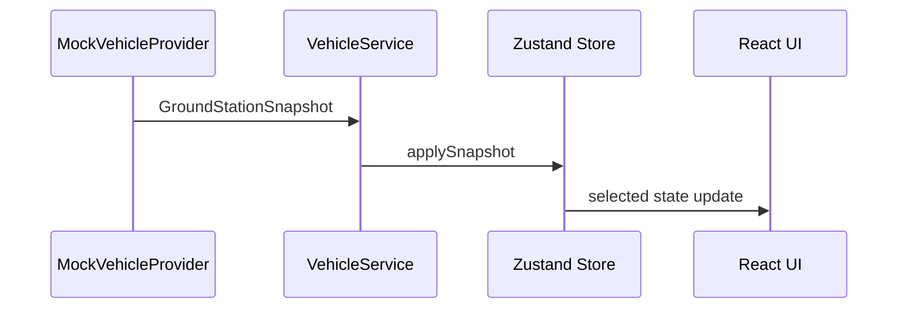
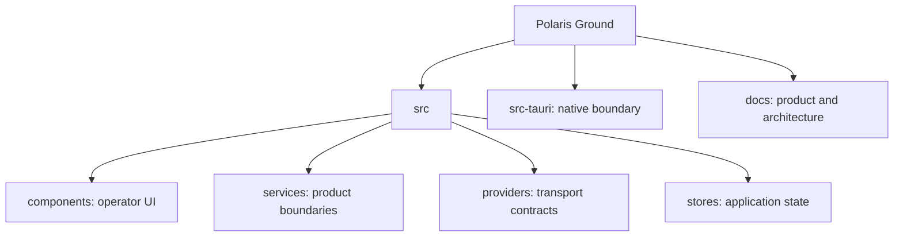

# Product Architecture

## Overall System

## UI Architecture

## Service Architecture

## Provider And Future Transport

## Data Flow

## Repository Layout

Operator components remain separate from future engineering tools. Future Vehicle Inspector, Protocol Inspector, Firmware Manager, Diagnostics, and raw telemetry views belong in a dedicated engineering feature area and must not alter the operator dashboard contract.
