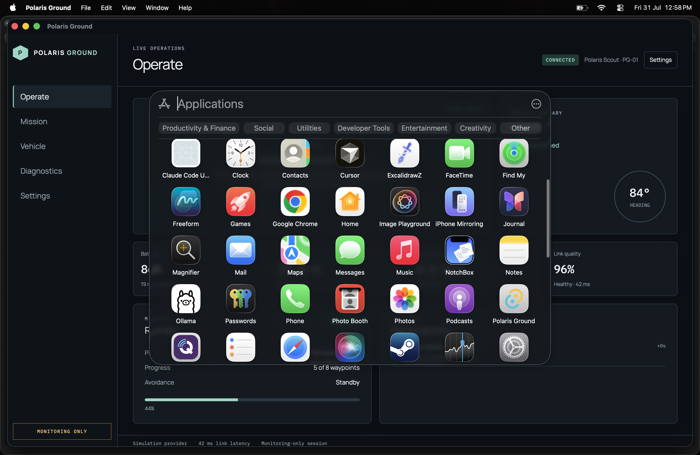

# Polaris Ground v0.1.0

## Purpose

v0.1.0 freezes the initial Polaris Ground product and architecture foundation. It demonstrates a native desktop monitoring experience with deterministic mock telemetry. It is not yet a real vehicle Ground Control Station.

## Included

- Native Tauri 2 desktop shell with React and TypeScript
- Monitoring-only Operations Workspace with vehicle, safety, mission, telemetry, and timeline presentation
- Protocol-independent VehicleProvider contract and MockVehicleProvider
- Product service boundaries and internal component/design system
- Architecture documentation, Mermaid diagrams, automated tests, and CI

## Architecture

The UI receives product-facing `GroundStationSnapshot` values through `VehicleService`. `MockVehicleProvider` is the only source in this release. A future real transport must implement the same provider contract without exposing protocol details to operator components.

## Screenshot

## Validation

The release baseline passes frontend lint, formatting, tests, production build, Rust formatting, Clippy, Rust tests, and an unsigned macOS debug Tauri build that produces a `.app` bundle and DMG.

## Limitations

No MAVLink, PX4 transport, real vehicle discovery, networking, USB/serial access, firmware flashing, flight controls, video streaming, or engineering mode is included.

## Next Milestone

Build a read-only transport adapter on `feature/mavlink-readonly-transport`, keeping all operator UI protocol-independent.
